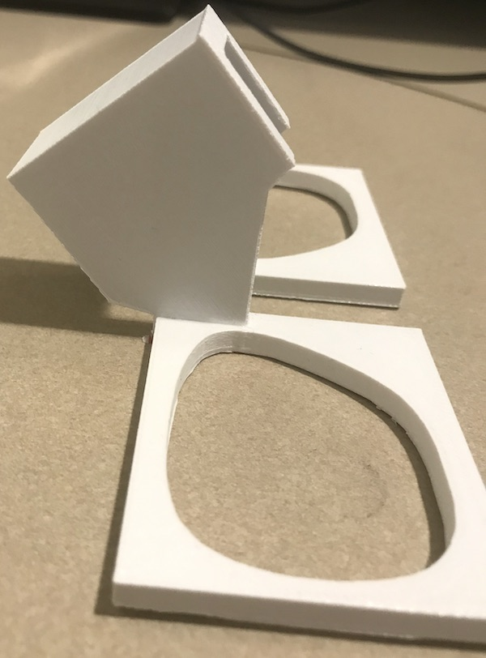
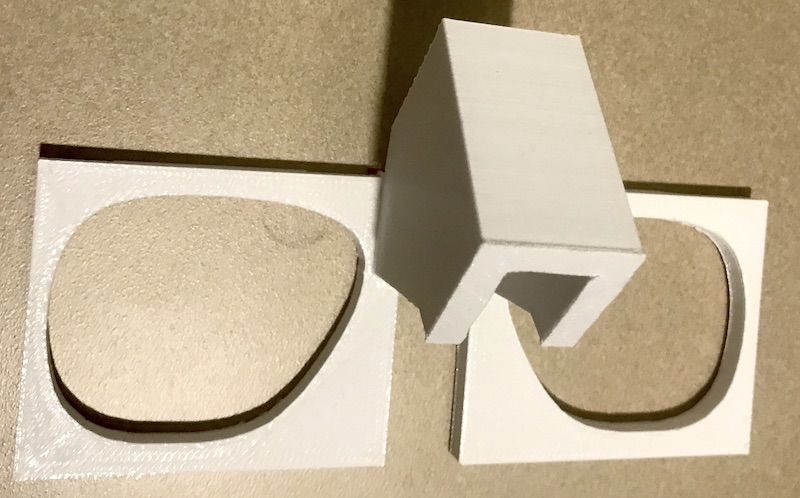

# 64ch-lensholder
Models for 3D printing a lens holder that fits in the Siemens Prisma 64-channel head/neck coil and holds lenses from the PST kit.

- `sketches` contains hand drawings and measurements
- `cad` contains the AutoCAD drawings
- `models` contains the STL files for printing
	- `support` is a piece that fits over the nose of the coil
	- `lens` is the holder for the (left) lens

## Printing

Print the `support.stl` and `lens.stl` files. I printed at [Voodoo Manufacturing](https://voodoomfg.com/ref?r_code=YDYIE) (referral link) using PLA. Make sure the print units are in centimeters.

## Assembly

The holder consists of two lens frames that need be attached to the support piece. I lightly sanded the parts and used superglue.

**Side view**

**Top view**)

## Use

- Carefully wedge the desired lenses into the frames by putting the bottom of the lens inside the frame and popping the top in. The thicker convex lenses are tricky to get in.
- Place the support over the nose piece of the head coil.

